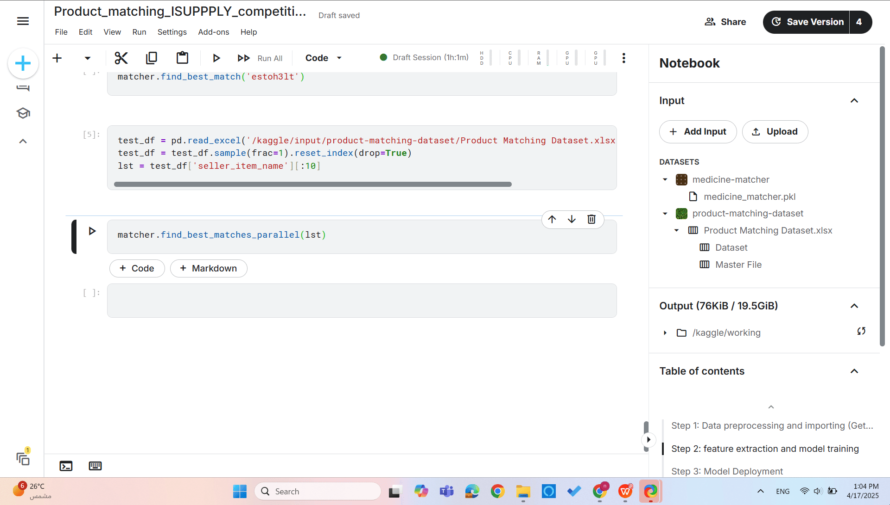

# Medicine_names_matching
A model that matches a medicine name (mostly in Arabic) that might contain typos or punctuations, to its correct full name.

# How to use the Model
- start off by the "importing libraries" cell, and install the libraries that you don't have (if you're working on Kaggle you'll only install rapidfuzz, which is the second input cell)
- Go all the way down to "Step 3: Model Deployment" section, and run the Class object cell (The first input cell after the section)
- run cell number 47 which starts with the comment "Load saved class", you might need to change the path of the file depending on wherer you put the "medicine_matcher.pkl" file in your device.
- use function "find_best_match" for passing a single medicine/drug name and getting the best match, or if you want to pass in a list of names (sheet of medicines) use function "find_best_matches_parallel"

  ### 🔄 Demo: Matching Medicines in Parallel

> This GIF demonstrates how the function **`find_best_matches_parallel()`** processes a list of medicine names in parallel and returns the closest matches.

